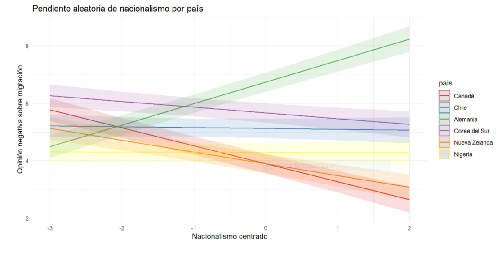

---
format:
  revealjs:
    title-slide: false
    logo: images/log.png
    theme: multinivel.scss
    incremental: true 
    slideNumber: true
    auto-stretch: false
    transition: fade
    transition-speed: slow
    execute:
      echo: false
      warning: false
      message: false
editor: source
---


# 

```{r echo=FALSE, warning=FALSE, message=FALSE, results='hide'}
if (!require("pacman")) install.packages("pacman") # solo la primera vez
pacman::p_load(lme4,
               kableExtra,
               haven,
               car,
               sjmisc,
               sjPlot,
               stargazer,
               ggplot2,
               ggrepel,
               ggeffects,# gráficos
               dplyr, # manipulacion de datos
               equatiomatic,
               htmltools) # paquetes a cargar

options(scipen = 999) # para desactivar notacion cientifica
rm(list = ls()) # para limpiar el entorno de trabajo

load("~/GitHub/trabajo1-grupo-4/output/data3.Rdata")
data <- data %>%
  rename(op_mig = perc_mig)
#modelos sin centrado
results_0 = lmer(op_mig ~ 1 + (1 | pais), data = data)
results_1 = lmer(op_mig ~ 1 + female + pos_pol + nacionalismo + personal_income + (1 | pais), data = data)
results_2 = lmer(op_mig ~ 1 + meanschooling + happines_promedio_pais + (1 | pais), data = data)
results_3 = lmer(op_mig ~ 1 + meanschooling + happines_promedio_pais + female + pos_pol + nacionalismo + personal_income + (1 | pais), data = data)
results_4=lmer(op_mig ~ 1 + meanschooling + happines_promedio_pais + female + pos_pol + nacionalismo + personal_income +( 1 + nacionalismo | pais), data = data)
results_5 = lmer(op_mig ~ 1 + meanschooling + happines_promedio_pais + female + pos_pol + nacionalismo + personal_income + happines_promedio_pais*nacionalismo + (1 | pais), data = data)

#modelos con centrado
model_1= lmer(op_mig ~ 1 + female + pos_pol_cmc + nacionalismo_cmc + personal_income_cmc + (1 | pais), data = data)
model_2= lmer (op_mig ~ 1 + meanschooling_gmc + happiness_gmc + (1 | pais), data = data)
model_3= lmer (op_mig ~ 1 + meanschooling_gmc + happiness_gmc + female + pos_pol_cmc + nacionalismo_cmc + personal_income_cmc + (1 | pais), data = data)
model_4= lmer (op_mig ~ 1 + meanschooling_gmc + happiness_gmc + female + pos_pol_cmc + nacionalismo_cmc + personal_income_cmc + (1 + nacionalismo_cmc | pais), data = data)
model_5 = lmer(op_mig ~ 1 + meanschooling_gmc + happiness_gmc + female + pos_pol_cmc + nacionalismo_cmc + personal_income_cmc + happiness_gmc*nacionalismo_cmc + (1 | pais), data = data)
```

:::::: columns
::: {.column width="20%"}
:::

:::: {.column .column-right width="80%"}
# **Opiniones negativas sobre la migración: la influencia del país y el contexto**

------------------------------------------------------------------------

**Paula Córdova, Jesús Díaz Molina & Benjamín Zavala**

::: {.red2 .medium}
**Análisis de datos multinivel - 2025**

**Departamento de Sociología, Universidad de Chile**
:::

Santiago, 24 de Junio de 2025
::::

[Github repo](https://github.com/multinivel-facso/trabajo1-grupo-4)
::::::

::: notes
Aquí mis notas
:::

# Introducción

## Objeto de estudio

-   Lo que se busca estudiar son las opiniones negativas hacia la migración y sus cambios según país.

-   La migración como fenómeno global ha emergido en los últimos años, a día de hoy más de 304 millones de migrantes en el mundo (ONU, 2025)

-   Ejemplo de esto es el aumento sostenido de la migración en países OCDE durante los últimos años (OCDE, 2024)

-   Este fenómeno es multicausal, donde podemos encontrar causas económicas, políticas o sociales (Armijos-Orellana et al, 2022)

## Factores asociados de nivel 1

-   En comparativa respecto a las mujeres, son los hombres quienes presentan una mayor tendencia de opiniones negativas hacia la migración (Servicio Jeusita de Migrantes, 2020)

-   Existe una tendencia entre posiciones de extrema derecha y opiniones negativas hacia los migrantes (Servicio Jesuita a Migrantes, 2020; Akkerman, 2018)

-   Las tendencias nacionalistas, a veces recaladas en el discurso "patriota", presentan una mayor tendencia hacia una opinión negativa a los migrantes (Akkerman, 2018; Buraschi y Aguilar-Idañez, 2023).

-   Aquellos sectores con menor nivel de ingreso, pueden presentar tendencias hacia opiniones más negativas contra los migrantes, debido por la competencia en puestos no especializados de trabajo. (Romero, 2021; Emmenegger y Klemmensen, 2013)

## Factores asociados de nivel 2

-   Desde la teoría psicosocial se plantea cómo las emociones pueden influir en una conducta prosocial, la cual vincula el trato y opinión frente a los migrantes. Un mayor bienestar emocional y sentimiento de felicidad tiene una asociación positiva con comportamientos prosociales (Espelt et al, 1998)

-   El nivel de escolaridad medio influye en las opiniones hacia los migrantes por un motivo parecido al de los sectores de menor ingreso, y es que se forma competencia por aquellos trabajos no especializados que no requieren escolaridad de más años (Emmenegger y Klemmensen, 2013)

##  {data-background-color="#5f5758"}

::: {.center .middle}
[¿En qué medida los factores contextuales de cada país, como su felicidad promedio y su promedio de escolaridad, y los factores individuales, como el ser mujer, la posición política, el nacionalismo, y el ingreso propio, influyen en tener una opinión negativa hacia las personas migrantes?]{style="font-size: 150%;"}
:::

# Hipótesis:

Nivel 1:

-   $H_1$: Personas que se identifican con posiciones políticas inclinadas a la derecha tenderán hacia opiniones más negativas respecto a la migración.

-   $H_2$: Personas con menores niveles de ingresos tenderán hacia una opinión más negativa hacia la migración.

-   $H_3$: Las mujeres tienen opiniones menos negativas hacia la migración que los hombres.

-   $H_4$: A mayor nivel de nacionalismo se presenta una mayor opinión negativa hacia la migración.

## Nivel 2

-   $H_5$: Países con menores promedios de años de escolaridad presentan opiniones más negativas hacia la migración.

-   $H_6$: Países con mayor felicidad promedio tenderán hacia opiniones menos negativas respecto a las personas migrantes.

Interacción entre niveles.

-   $H_7$: El promedio de felicidad de un país atenúa el efecto del nacionalismo en la opinión frente a los migrantes.

# Metodología {data-background-color="#5f5758"}

## Datos

-   Séptima ola del World Values Survey (WVS), con datos recolectados entre 2017 y 2022.

-   Presenta datos individuales y contextuales por país, obtenidos de otras instituciones.

-   Tras limpieza con listwise, 54716 casos y 46 países.

-   Construcción de una escala de opiniones negativas sobre la migración con 5 variables de la base, obteniendo un alfa de cronbach .77.

## Variables {.scrollable .smaller}

```{r tbl-1, results='hide'}

#Variables nivel 1 individual

nivel1 <- data %>%
  select(op_mig, female, nacionalismo, pos_pol, personal_income)

desc_level_1 <- stargazer(as.data.frame(nivel1),
          type = "html",
          title = "Nivel 1 (individual)",
          digits = 2, summary.stat = c("n","min", "median", "mean", "max", "sd"))

# Variables de nivel 2 (contextual)
nivel2 <- data %>%
  select(pais, happines_promedio_pais, meanschooling) %>%
  distinct()  # evitar duplicados por comuna

desc_level_2 <- stargazer(as.data.frame(nivel2),
          type = "html",
          title = "Nivel 2 (país)",
          digits = 2, summary.stat = c("n", "min", "median", "mean", "max","sd"))

```

```{r, results='asis'}
# Mostrar ambas tablas con títulos manuales
cat("
<h3><strong>Estadísticos descriptivos de Nivel 1 (individual)</strong></h3>
", desc_level_1, "
<br><br>
<h3><strong>Estadísticos descriptivos de Nivel 2 (país)</strong></h3>
", desc_level_2)
```

## Métodos {.smaller}

::: {style="font-size: 90%;"}
Se estimaron un total de 6 modelos:
:::

::: {style="font-size: 90%;"}
Modelo nulo
:::

::: {style="font-size: 80%;"}
$$
\text{op_mig}_{ij} = \gamma_{00} + u_{0j} + r_{ij}
$$
:::

::: {style="font-size: 90%;"}
Modelo 1: con variables individuales
:::

::: {style="font-size: 75%;"}
$$
\text{op_mig}_{ij} = \gamma_{00} + \gamma_{01} \text{female} + \gamma_{02} \text{pos_pol} + \gamma_{03} \text{nacionalismo} + \gamma_{04} \text{personal_income} + u_{0j} + r_{ij}
$$
:::

::: {style="font-size: 90%;"}
Modelo 2: con variables contextuales
:::

::: {style="font-size: 80%;"}
$$
\text{op_mig}_{ij} = \gamma_{00} + \gamma_{01} \text{meanschooling}+ \gamma_{02} \text{happiness_promedio_pais} + u_{0j} + r_{ij}
$$
:::

::: {style="font-size: 90%;"}
Modelo 3: multinivel
:::

::: {style="font-size: 80%;"}
$$
\begin{align*}
\text{op_mig}_{ij} &= \gamma_{00} + \gamma_{01} \text{meanschooling} + \gamma_{02} \text{happiness_promedio_pais} + \gamma_{03} \text{female} + \gamma_{04} \text{pos_pol} + \gamma_{05} \text{nacionalismo} \\ + &\gamma_{06} \text{personal_income} + u_{0j} + r_{ij}\end{align*}
$$
:::

::: {style="font-size: 90%;"}
Modelo 4: con pendiente aleatoria
:::

::: {style="font-size: 80%;"}
$$
\begin{align*}
\text{op_mig}_{ij} &= \gamma_{00} + \gamma_{01} \text{meanschooling} + \gamma_{02} \text{happiness_promedio_pais} + \gamma_{03} \text{female} + \gamma_{04} \text{pos_pol} + \gamma_{05} \text{nacionalismo} \\ + &\gamma_{06} \text{personal_income} + u_{0j} + u_{1j} \text{nacionalismo} + r_{ij} \end{align*}
$$
:::

::: {style="font-size: 90%;"}
Modelo 5: interacción entre niveles
:::

::: {style="font-size: 80%;"}
$$
\begin{align*}
\text{op_mig}_{ij} &= \gamma_{00} + \gamma_{01} \text{meanschooling} + \gamma_{02} \text{happiness_promedio_pais} + \gamma_{03} \text{female} + \gamma_{04} \text{pos_pol} + \gamma_{05} \text{nacionalismo} \\ + &\gamma_{06} \text{personal_income} + \gamma_{07} \text{happiness_promedio_pais} \times \text{nacionalismo} + u_{0j} + r_{ij} \end{align*}
$$
:::

# Resultados {data-background-color="#5f5758"}

## Descriptivos

```{r echo=FALSE, warning=FALSE, message=FALSE, results='hide'}

#datos scatterplot
graf_scatt <- data %>%
  group_by(pais) %>%
  summarise(
    op_mig_prom = mean(op_mig, na.rm = TRUE),
    happiness_prom = mean(happines_promedio_pais, na.rm = TRUE),
    meanschooling_prom = mean(meanschooling, na.rm = TRUE)
  ) %>%
  na.omit()

graf_scatt$pais <- recode(graf_scatt$pais,
  `32` = "Argentina",
  `36` = "Australia",
  `50` = "Bangladés",
  `51` = "Armenia",
  `68` = "Bolivia",
  `76` = "Brasil",
  `124` = "Canadá",
  `152` = "Chile",
  `170` = "Colombia",
  `196` = "Chipre",
  `203` = "Chequia",
  `218` = "Ecuador",
  `231` = "Etiopía",
  `276` = "Alemania",
  `300` = "Grecia",
  `320` = "Guatemala",
  `356` = "India",
  `360` = "Indonesia",
  `392` = "Japón",
  `404` = "Kenia",
  `410` = "Corea del Sur",
  `458` = "Malasia",
  `484` = "México",
  `496` = "Mongolia",
  `504` = "Marruecos",
  `528` = "Países Bajos",
  `554` = "Nueva Zelanda",
  `558` = "Nicaragua",
  `566` = "Nigeria",
  `604` = "Perú",
  `608` = "Filipinas",
  `642` = "Rumania",
  `643` = "Rusia",
  `688` = "Serbia",
  `702` = "Singapur",
  `703` = "Eslovaquia",
  `716` = "Zimbabue",
  `762` = "Tayikistán",
  `764` = "Tailandia",
  `788` = "Túnez",
  `792` = "Turquía",
  `804` = "Ucrania",
  `826` = "Reino Unido",
  `840` = "Estados Unidos",
  `858` = "Uruguay",
  `862` = "Venezuela"
)
```

```{r echo=FALSE, warning=FALSE, message=FALSE, results='asis'}
#cambiar nombres variables del gráfico
plot_scatter(graf_scatt,
             x = meanschooling_prom, 
             y = op_mig_prom,
             dot.labels = graf_scatt$pais,
             fit.line = "lm",
             show.ci = TRUE) + 
  labs(x = "Nivel promedio de escolaridad del país",
       y = "Opinión negativa promedio sobre migración",
       title = "Scatterplot: Relación entre escolaridad y opinión negativa sobre migración")
```

## Descriptivos

```{r echo=FALSE, warning=FALSE, message=FALSE, results='asis'}
#cambiar nombres variables del gráfico
plot_scatter(graf_scatt,
             x = happiness_prom, 
             y = op_mig_prom,
             dot.labels = graf_scatt$pais,
             fit.line = "lm",
             show.ci = TRUE) + 
  labs(x = "Nivel promedio de felicidad del país",
       y = "Opinión negativa promedio sobre migración",
       title = "Scatterplot: Relación entre felicidad y opinión negativa sobre migración")
```

## Modelos

```{r echo=FALSE, warning=FALSE, message=FALSE, results='hide'}
#sin centrado
mtabla_sc <-tab_model(results_0, results_1, results_2, results_3, results_4, results_5,
  show.ci = FALSE, 
  show.se = TRUE,
  dv.labels = c("Nulo","Individual", "Agregado", "Multinivel", "Pendiente aleatoria nacionalismo", "Interacción entre niveles"),
  file = NA)

tabla_sc <- paste0(
  "<style>",
  ".hscroll-sc {",
  "  overflow-x: auto;",
  "  overflow-y: auto;",
  "  max-width: 95vw;",
  "  max-height: 600px;",
  "  margin: 0 auto;",
  "}",
  ".small-table-sc {font-size: 0.5em;}",
  "</style>",
  '<div class="hscroll-sc small-table-sc">',
  mtabla_sc$page.content,
  "</div>")

knitr::asis_output(tabla_sc)
invisible(NULL)      

```

```{r echo=FALSE, warning=FALSE, message=FALSE, results='asis'}
#con centrado
mtabla_cc <- tab_model(results_0, model_1, model_2, model_3, model_4, model_5, 
  show.ci = FALSE, 
  show.se = TRUE,
  dv.labels = c("Nulo","Individual", "Agregado", "Multinivel", "Pendiente aleatoria nacionalismo", "Interacción entre niveles"),
  file = NA)

tabla_cc <- paste0(
  "<style>",
  ".hscroll-cc {",
  "  overflow-x: auto;",
  "  overflow-y: auto;",
  "  max-width: 95vw;",
  "  max-height: 600px;",
  "  margin: 0 auto;",
  "}",
  ".small-table-cc {font-size: 0.5em;}",
  "</style>",
  '<div class="hscroll-cc small-table-cc">',
  mtabla_cc$page.content,
  "</div>")
knitr::asis_output(tabla_cc)
invisible(NULL)  
```

## Test de devianza

```{r echo=FALSE, warning=FALSE, message=FALSE, results='asis'}

t_devianza <- anova(model_4, model_5)%>%
  as.data.frame()

row.names(t_devianza) <- c( "Modelo 4: Pendiente aleatoria",
                            "Modelo 5: Interacción entre niveles")

t_devianza %>%
  kableExtra::kable(digits = 3, caption = "Comparación de modelos") %>%
  kableExtra::kable_styling(
    full_width = FALSE,
    bootstrap_options = c("striped", "hover", "condensed"),
    font_size = 18  # reduce tamaño fuente, default suele ser 14
  )
```

## Pendiente aleatoria

```{r echo=FALSE, warning=FALSE, message=FALSE, results='hide'}
graf_pendiente <- ggpredict(model_4,
                            terms = c("nacionalismo_cmc", "pais                               [152,276,410,554,566,124]"),
                            type = "random")

graf_pendiente$group <- recode(graf_pendiente$group,
                               `152` = "Chile",
                               `276` = "Alemania",
                               `410` = "Corea del Sur",
                               `554` = "Nueva Zelanda",
                               `566` = "Nigeria",
                               `124` = "Canadá")
#grafico
graf<-plot(graf_pendiente) +
  labs(title = "Pendiente aleatoria de nacionalismo por país",
       x = "Nacionalismo centrado",
       y = "Opinión negativa sobre migración") +
  theme_minimal()


```
```{r, echo=FALSE, out.width="80%"}

```


# Conclusiones {data-background-color="black"}

::: incremental
## Interacción

::::: columns

```{r echo=FALSE, warning=FALSE, message=FALSE, results='asis'}

plot_model(model_5,
           type = "int",
           terms = c("nacionalismo_cmc", "happiness_gmc")) +
  labs(
    title  = "Interacción: Nacionalismo individual × Promedio de felicidad del país",
    x      = "Nacionalismo (centrado)",
    y      = "Opinión negativa sobre migración",
    colour = "Felicidad promedio del país"
  ) +
  scale_color_manual(values = c("#1b9e77", "#d95f02", "#7570b3")) +
  theme_minimal(base_size = 12) +
  theme(
    plot.title = element_text(face = "bold", hjust = 0.5),
    legend.position = "bottom")

```
:::
:::::

## Casos influyentes

```{r echo=FALSE, warning=FALSE, message=FALSE, results='asis'}
library(influence.ME)

inf_4 <- influence(model_4, "pais")

cook <- cooks.distance(inf_4, sort = TRUE)

corte <- 4/46 # cut point

influyentes <- names(cook)[!is.na(cook) & cook > corte] 

cat("Países influyentes (cook > ", round(corte, 3), "):\n") 

plot(inf_4, which="cook",
     cutoff=corte, sort=TRUE,
     xlab="Cooks Distance",
     ylab="Pais")
```

```{r echo=FALSE, warning=FALSE, message=FALSE, results='hide'}
sigtest(inf_4, test=-1.96)$happiness_gmc[1:46,]

```

## Modelo sin influyentes

```{r echo=FALSE, warning=FALSE, message=FALSE, results='asis'}
datab <- filter(data, !pais %in% c(50, 51, 68, 76, 124, 152, 170, 196, 203, 218, 231, 276, 320, 356, 392, 404, 496, 504, 528, 558, 566, 604, 702, 716, 764, 788, 862, 640))

model_4b= lmer (op_mig ~ 1 + meanschooling_gmc + happiness_gmc + female + pos_pol_cmc + nacionalismo_cmc + personal_income_cmc + (1 + nacionalismo_cmc | pais), data = datab)


tab_inf <- sjPlot::tab_model(model_4, model_4b, 
                  show.ci = FALSE,
                  dv.labels = c("Modelo original", "Modelo sin influyentes"))

tablas_inf <- paste0(
  "<style>",
  ".hscroll-sc {",
  "  overflow-x: auto;",
  "  overflow-y: auto;",
  "  max-width: 95vw;",
  "  max-height: 600px;",
  "  margin: 0 auto;",
  "}",
  ".small-table-sc {font-size: 0.5em;}",
  "</style>",
  '<div class="hscroll-sc small-table-sc">',
  tab_inf$page.content,
  "</div>")

knitr::asis_output(tablas_inf)
invisible(NULL)
```

# Conclusiones {data-background-color="#5f5758"}

::: incremental
-   **Hipótesis 1:** Se comprueba con significancia estadística, aunque con un efecto muy bajo.
-   **Hipótesis 2:** Se comprueba con significancia estadística, aunque con un efecto muy bajo.
-   **Hipótesis 3:** Se comprueba con significancia estadística; el efecto es bajo, pero mayor que el de las demás variables.
-   **Hipótesis 4:** Se rechaza con un efecto sin significancia estadística. No hay diferencia significativa entre hombres y mujeres respecto a las opiniones sobre la migración
:::

# Conclusiones (cont.) {data-background-color="#5f5758"}

::: incremental
-   **Hipótesis 5:** Se rechaza con un efecto sin significancia estadística. El nivel educativo no tiene efecto significativo sobre la opinión a los migrantes.
-   **Hipótesis 6:** Se comprueba con un efecto importante y con significancia estadística.
-   **Hipótesis 7:** El promedio de felicidad del país atenúa levemente el efecto del nacionalismo, según el gráfico de interacción, pero pierde significancia estadística. Por ende se rechaza la hipótesis
:::

## Referencias

::: {style="font-size: 80%; line-height: 1.2;"}
Akkerman, T. (2024). *Inmigración y redistribución en Europa...* [link](https://www.cidob.org/sites/default/files/2024-09/47-62_TJITSKE%20AKKERMAN.pdf)\
Armijos-Orellana, A. C., et al. (2022). *Los motivos de la migración...* [link](https://doi.org/10.17163/uni.n37.2022.09)\
Buraschi, D., & Aguilar-Idañez, M. J. (2023). *La amenaza percibida...* [link](https://revistas.comillas.edu/index.php/revistamigraciones/article/view/18461/17228)\
Emmenegger, P., & Klemmensen, R. (2013). *Immigration and redistribution revisited...* [link](https://doi.org/10.1177/0958928713492773)\
Espelt, E., Carballeira, A. R., Alvarez, J. M. C., & Mazón, F. J. (1998). *Felicidad y conducta prosocial: un estudio a partir de las encuestas del CIRES...*

OCDE (2024). *International Migration Outlook 2024...* [link](https://doi.org/10.1787/50b0353e-en)\
ONU (2025). *Migración*. [link](https://www.un.org/es/global-issues/migration)\
Romero Montero, A. (2021). *Actitudes hacia la inmigración...* [link](https://ddd.uab.cat/pub/tfg/2021/tfg_375812/TFG_aromeromontero2.pdf)\
SJM Chile (2020). *Barómetro de percepción de la migración...* [link](https://sjmchile.org/wp-content/uploads/2024/01/barometrofinal.pdf)
:::
